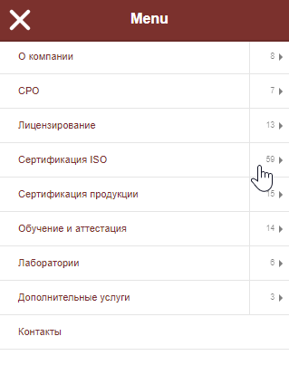
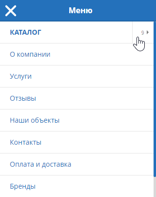

# Multi-level mobile menu 

Простое многоуровневое мобильное меню.




## Установка

```
npm install cool-menu
```

или подключение в html

```html
<srcipt src="path-to/cool-menu.js"></script>
```

## Использование

```javascript
import CoolMenu from 'cool-menu'; // Если используется бандлер

const coolMenu = new CoolMenu({
    source: [
        {
            container    : document.querySelector('.catalog-navigation__dropdown > ul'),
            selectorTitle: '.catalog-menu__link',
            selectorList : '.catalog-menu',
            group        : {
                title          : 'Каталог',
                link           : '#',
                customItemClass: 'cool-menu-group-item',
                customLinkClass: 'cool-menu-group-link',
            },
        },
        document.querySelector('#menu > ul.menu')
    ],
    button: document.querySelector('.menu-button'),
});

coolMenu.create();
``` 

Источник данных может задаваться как ссылка на элемент UL на странице или как объект с дополнительными параметрами.

Поля объекта:

| Option | Type | Default | Description
|:---|:---|:---|:---|
| `container` | HTMLElement, null | `null` | Источник данных для меню
| `selectorTitle` | String | `'a'` | Селектор для поиска заголовка пункта меню
| `selectorList` | String | `'ul'` | Селектор для поиска вложенного списка пункта меню
| `group` | object, null| `null` | Параметры группировки

Отдельные источники меню можно сгруппировать, оформив их как подменю. Параметры группировки:

| Option | Type | Default | Description
|:---|:---|:---|:---|
| `group.title` | String | `''` | Заголовок пункта меню
| `group.link` | String | `'#'` | Ссылка пункта меню
| `group.customItemClass` | String | `''` | Класс, который буден дописан к этому пункту
| `group.customLinkClass` | String | `''` | Класс, который буден дописан к ссылке этого пункта

Стили следует подключить отдельно

```scss
@import './node_modules/cool-menu/cool-menu.scss';
```

В стилях доступно переопределение следующих переменных:

```scss
$cool-menu-z-index: 9999 !default;
$cool-menu-width: 320px !default;
$cool-menu-color: #475577 !default;
$cool-menu-clip-body-when-opened: false !default;
```

## Опции

В качестве источника данных используется готовая разметка на странице, построенная на списках UL/OL. В параметр `source` передается массив DOM-элементов.

| Option | Default | Description
|:---|:---|:---|
| `source` | `null` | Источник данных для меню
| `button` | `null` | Кнопка переключения меню
| `container` | `document.body` | Контейнер, в котором будет рендерится меню
| `width` | `320` | Максимальная ширина меню
| `delimiter` | `false` | Не используется
| `headerText` | `'Menu'` | Заголовок меню
| `rootClass` | `'cool-menu'` | CSS-класс
| `stateOpenClass` | `'cool-menu_open'` | CSS-класс
| `scrollPaneClass` | `'cool-menu__scroll-pane'` | CSS-класс
| `closerClass` | `'cool-menu__closer'` | CSS-класс
| `headerClass` | `'cool-menu__header'` | CSS-класс
| `headerInnerClass` | `'cool-menu__header-in'` | CSS-класс
| `headerActiveClass` | `'cool-menu__header_active'` | CSS-класс
| `menuClass` | `'cool-menu__menu'` | CSS-класс
| `menuItemClass` | `'cool-menu__item'` | CSS-класс
| `menuLinkClass` | `'cool-menu__link'` | CSS-класс
| `menuNestedClass` | `'cool-menu__nested'` | CSS-класс
| `backdropClass` | `'cool-menu-backdrop'` | CSS-класс
| `buttonOpenClass` | `'open'` | CSS-класс
| `bodyOpenClass` | `'is-open-cool-menu'` | CSS-класс
| `onClose` | `null` | Коллбэк на закрытие меню
